<!--
Всем привет. Меня зовут Дмитрий. На слайде вы видите название доклада, но это не полное название. А полное звучит так: "Быстрее быстрой, или Как обогнать std::sort с помощью поразрядной сортировки, А также о пользе велосипедостроения.

После прослушивания этого доклада ваша жизнь станет лучше, но, одновременно с этим, сложнее.
"Смотреть всем до конца."

Эта история о том, что нельзя слепо доверять общественному мнению, что нужно всё проверять своими собственными руками, и о том, что самая простая вещь может повлиять на самый широкий круг людей (под людьми я, конечно, понимаю плюсовиков).

Эта история длиной почти в пятнадцать лет, полная взлётов и падений, но, разумеется, со счастливым концом.
-->


# Быстрее быстрой, или Как обогнать `std::sort` с&nbsp;помощью поразрядной сортировки

Дмитрий Изволов

---

<!--
Давным-давно, году в 2011-2012 пришёл на собеседование в одну компанию:
на "я" начинается, на "с" заканчивается. Как вы догадались, что это Яндекс?!
Собеседование тогда проводили примерно в 73 этапа.
И вот, на одном из этапов, нужно было сидя в офисе написать программу.
На написание давали 4 часа. *Что* надо написать — заранее, конечно, не
известно.
-->


---

<!--
И вот, пришёл я в офис, сел в переговорку, жду.
Пришёл собеседующий.
Спрашивает: знаешь алгоритм поразрядной сортировки?
Говорю: нет.
Он мне коротко изложил алгоритм и ушёл. А я стал писать код.

Давайте и я сейчас коротко изложу, что это такое.
-->


___

<!--
Чтобы понять, что такое поразрядная сортировка, нужно начать с сортировки
подсчётом. Представим, для простоты, что мы сортируем числа, состоящие из
одного десятичного разряда. То есть диапазон возможных значений — от 0 до 9. Но у нас числа только до семи, поэтому для простоты счётчики для 8 и 9 я показывать не буду.
-->


# Подсчёт

<style scoped>
table, blockquote {
    font-size: 60px;
    font-family: monospace;
}
</style>

Числа

> <b>317421327</b>

Счётчики

| 0 | 1 | 2 | 3 | 4 | 5 | 6 | 7 |
|:--|:--|:--|:--|:--|:--|:--|:--|
| 0 | 0 | 0 | 0 | 0 | 0 | 0 | 0 |


___


# Подсчёт

<style scoped>
table, blockquote {
    font-size: 60px;
    font-family: monospace;
}
</style>

Числа

> <b><span class="highlighted">3</span>17421327</b>

Счётчики

| 0 | 1 | 2 | <span class="highlighted">3</span> | 4 | 5 | 6 | 7 |
|:--|:--|:--|:--|:--|:--|:--|:--|
| 0 | 0 | 0 | <span class="highlighted">0</span> | 0 | 0 | 0 | 0 |

___


# Подсчёт

<style scoped>
table, blockquote {
    font-size: 60px;
    font-family: monospace;
}
</style>

Числа

> <b><span class="highlighted">3</span>17421327</b>

Счётчики

| 0 | 1 | 2 | <span class="highlighted">3</span> | 4 | 5 | 6 | 7 |
|:--|:--|:--|:--|:--|:--|:--|:--|
| 0 | 0 | 0 | <span class="bright">1</span> | 0 | 0 | 0 | 0 |

___


# Подсчёт

<style scoped>
table, blockquote {
    font-size: 60px;
    font-family: monospace;
}
</style>

Числа

> <b>3<span class="highlighted">1</span>7421327</b>

Счётчики

| 0 | <span class="highlighted">1</span> | 2 | 3 | 4 | 5 | 6 | 7 |
|:--|:--|:--|:--|:--|:--|:--|:--|
| 0 | <span class="highlighted">0</span> | 0 | 1 | 0 | 0 | 0 | 0 |

___


# Подсчёт

<style scoped>
table, blockquote {
    font-size: 60px;
    font-family: monospace;
}
</style>

Числа

> <b>3<span class="highlighted">1</span>7421327</b>

Счётчики

| 0 | <span class="highlighted">1</span> | 2 | 3 | 4 | 5 | 6 | 7 |
|:--|:--|:--|:--|:--|:--|:--|:--|
| 0 | <span class="bright">1</span> | 0 | 1 | 0 | 0 | 0 | 0 |

___


# Подсчёт

<style scoped>
table, blockquote {
    font-size: 60px;
    font-family: monospace;
}
</style>

Числа

> <b>31<span class="highlighted">7</span>421327</b>

Счётчики

| 0 | 1 | 2 | 3 | 4 | 5 | 6 | <span class="highlighted">7</span> |
|:--|:--|:--|:--|:--|:--|:--|:--|
| 0 | 1 | 0 | 1 | 0 | 0 | 0 | <span class="highlighted">0</span> |

___


# Подсчёт

<style scoped>
table, blockquote {
    font-size: 60px;
    font-family: monospace;
}
</style>

Числа

> <b>31<span class="highlighted">7</span>421327</b>

Счётчики

| 0 | 1 | 2 | 3 | 4 | 5 | 6 | <span class="highlighted">7</span> |
|:--|:--|:--|:--|:--|:--|:--|:--|
| 0 | 1 | 0 | 1 | 0 | 0 | 0 | <span class="bright">1</span> |

___


# Подсчёт

<style scoped>
table, blockquote {
    font-size: 60px;
    font-family: monospace;
}
</style>

Числа

> <b>317<span class="highlighted">4</span>21327</b>

Счётчики

| 0 | 1 | 2 | 3 | <span class="highlighted">4</span> | 5 | 6 | 7 |
|:--|:--|:--|:--|:--|:--|:--|:--|
| 0 | 1 | 0 | 1 | <span class="highlighted">0</span> | 0 | 0 | 1 |

___


# Подсчёт

<style scoped>
table, blockquote {
    font-size: 60px;
    font-family: monospace;
}
</style>

Числа

> <b>317<span class="highlighted">4</span>21327</b>

Счётчики

| 0 | 1 | 2 | 3 | <span class="highlighted">4</span> | 5 | 6 | 7 |
|:--|:--|:--|:--|:--|:--|:--|:--|
| 0 | 1 | 0 | 1 | <span class="bright">1</span> | 0 | 0 | 1 |

___


# Подсчёт

<style scoped>
table, blockquote {
    font-size: 60px;
    font-family: monospace;
}
</style>

Числа

> <b>3174<span class="highlighted">2</span>1327</b>

Счётчики

| 0 | 1 | <span class="highlighted">2</span> | 3 | 4 | 5 | 6 | 7 |
|:--|:--|:--|:--|:--|:--|:--|:--|
| 0 | 1 | <span class="highlighted">0</span> | 1 | 1 | 0 | 0 | 1 |

___


# Подсчёт

<style scoped>
table, blockquote {
    font-size: 60px;
    font-family: monospace;
}
</style>

Числа

> <b>3174<span class="highlighted">2</span>1327</b>

Счётчики

| 0 | 1 | <span class="highlighted">2</span> | 3 | 4 | 5 | 6 | 7 |
|:--|:--|:--|:--|:--|:--|:--|:--|
| 0 | 1 | <span class="bright">1</span> | 1 | 1 | 0 | 0 | 1 |

___


# Подсчёт

<style scoped>
table, blockquote {
    font-size: 60px;
    font-family: monospace;
}
</style>

Числа

> <b>31742<span class="highlighted">1</span>327</b>

Счётчики

| 0 | <span class="highlighted">1</span> | 2 | 3 | 4 | 5 | 6 | 7 |
|:--|:--|:--|:--|:--|:--|:--|:--|
| 0 | <span class="highlighted">1</span> | 1 | 1 | 1 | 0 | 0 | 1 |

___


# Подсчёт

<style scoped>
table, blockquote {
    font-size: 60px;
    font-family: monospace;
}
</style>

Числа

> <b>31742<span class="highlighted">1</span>327</b>

Счётчики

| 0 | <span class="highlighted">1</span> | 2 | 3 | 4 | 5 | 6 | 7 |
|:--|:--|:--|:--|:--|:--|:--|:--|
| 0 | <span class="bright">2</span> | 1 | 1 | 1 | 0 | 0 | 1 |

___


# Подсчёт

<style scoped>
table, blockquote {
    font-size: 60px;
    font-family: monospace;
}
</style>

Числа

> <b>317421<span class="highlighted">3</span>27</b>

Счётчики

| 0 | 1 | 2 | <span class="highlighted">3</span> | 4 | 5 | 6 | 7 |
|:--|:--|:--|:--|:--|:--|:--|:--|
| 0 | 2 | 1 | <span class="highlighted">1</span> | 1 | 0 | 0 | 1 |

___


# Подсчёт

<style scoped>
table, blockquote {
    font-size: 60px;
    font-family: monospace;
}
</style>

Числа

> <b>317421<span class="highlighted">3</span>27</b>

Счётчики

| 0 | 1 | 2 | <span class="highlighted">3</span> | 4 | 5 | 6 | 7 |
|:--|:--|:--|:--|:--|:--|:--|:--|
| 0 | 2 | 1 | <span class="bright">2</span> | 1 | 0 | 0 | 1 |

___


# Подсчёт

<style scoped>
table, blockquote {
    font-size: 60px;
    font-family: monospace;
}
</style>

Числа

> <b>3174213<span class="highlighted">2</span>7</b>

Счётчики

| 0 | 1 | <span class="highlighted">2</span> | 3 | 4 | 5 | 6 | 7 |
|:--|:--|:--|:--|:--|:--|:--|:--|
| 0 | 2 | <span class="highlighted">1</span> | 2 | 1 | 0 | 0 | 1 |

___


# Подсчёт

<style scoped>
table, blockquote {
    font-size: 60px;
    font-family: monospace;
}
</style>

Числа

> <b>3174213<span class="highlighted">2</span>7</b>

Счётчики

| 0 | 1 | <span class="highlighted">2</span> | 3 | 4 | 5 | 6 | 7 |
|:--|:--|:--|:--|:--|:--|:--|:--|
| 0 | 2 | <span class="bright">2</span> | 2 | 1 | 0 | 0 | 1 |

___


# Подсчёт

<style scoped>
table, blockquote {
    font-size: 60px;
    font-family: monospace;
}
</style>

Числа

> <b>31742132<span class="highlighted">7</span></b>

Счётчики

| 0 | 1 | 2 | 3 | 4 | 5 | 6 | <span class="highlighted">7</span> |
|:--|:--|:--|:--|:--|:--|:--|:--|
| 0 | 2 | 2 | 2 | 1 | 0 | 0 | <span class="highlighted">1</span> |

___


# Подсчёт

<style scoped>
table, blockquote {
    font-size: 60px;
    font-family: monospace;
}
</style>

Числа

> <b>31742132<span class="highlighted">7</span></b>

Счётчики

| 0 | 1 | 2 | 3 | 4 | 5 | 6 | <span class="highlighted">7</span> |
|:--|:--|:--|:--|:--|:--|:--|:--|
| 0 | 2 | 2 | 2 | 1 | 0 | 0 | <span class="bright">2</span> |

___


# Подсчёт

<style scoped>
table, blockquote {
    font-size: 60px;
    font-family: monospace;
}
</style>

Числа

> <b>317421327</b>

Счётчики

| 0 | 1 | 2 | 3 | 4 | 5 | 6 | 7 |
|:--|:--|:--|:--|:--|:--|:--|:--|
| 0 | 2 | 2 | 2 | 1 | 0 | 0 | 2 |

___


# Суммирование

<!-- 
Теперь нужно вычислить кумулятивную сумму счётчиков.
По сути, вызвать `std::partial_sum`.
-->

<style scoped>
table, blockquote {
    font-size: 60px;
    font-family: monospace;
}
</style>

Числа

> <b>317421327</b>

Счётчики

| 0 | 1 | 2 | 3 | 4 | 5 | 6 | 7 |
|:--|:--|:--|:--|:--|:--|:--|:--|
| <span class="highlighted">0</span> | <span class="highlighted">2</span> | 2 | 2 | 1 | 0 | 0 | 2 |

___


# Суммирование

<style scoped>
table, blockquote {
    font-size: 60px;
    font-family: monospace;
}
</style>

Числа

> <b>317421327</b>

Счётчики

| 0 | 1 | 2 | 3 | 4 | 5 | 6 | 7 |
|:--|:--|:--|:--|:--|:--|:--|:--|
| <span class="highlighted">0</span> | <span class="bright">2</span> | 2 | 2 | 1 | 0 | 0 | 2 |

___


# Суммирование

<style scoped>
table, blockquote {
    font-size: 60px;
    font-family: monospace;
}
</style>

Числа

> <b>317421327</b>

Счётчики

| 0 | 1 | 2 | 3 | 4 | 5 | 6 | 7 |
|:--|:--|:--|:--|:--|:--|:--|:--|
| 0 | <span class="highlighted">2</span> | <span class="highlighted">2</span> | 2 | 1 | 0 | 0 | 2 |

___


# Суммирование

<style scoped>
table, blockquote {
    font-size: 60px;
    font-family: monospace;
}
</style>

Числа

> <b>317421327</b>

Счётчики

| 0 | 1 | 2 | 3 | 4 | 5 | 6 | 7 |
|:--|:--|:--|:--|:--|:--|:--|:--|
| 0 | <span class="highlighted">2</span> | <span class="bright">4</span> | 2 | 1 | 0 | 0 | 2 |

___


# Суммирование

<style scoped>
table, blockquote {
    font-size: 60px;
    font-family: monospace;
}
</style>

Числа

> <b>317421327</b>

Счётчики

| 0 | 1 | 2 | 3 | 4 | 5 | 6 | 7 |
|:--|:--|:--|:--|:--|:--|:--|:--|
| 0 | 2 | <span class="highlighted">4</span> | <span class="highlighted">2</span> | 1 | 0 | 0 | 2 |

___


# Суммирование

<style scoped>
table, blockquote {
    font-size: 60px;
    font-family: monospace;
}
</style>

Числа

> <b>317421327</b>

Счётчики

| 0 | 1 | 2 | 3 | 4 | 5 | 6 | 7 |
|:--|:--|:--|:--|:--|:--|:--|:--|
| 0 | 2 | <span class="highlighted">4</span> | <span class="bright">6</span> | 1 | 0 | 0 | 2 |

___


# Суммирование

<style scoped>
table, blockquote {
    font-size: 60px;
    font-family: monospace;
}
</style>

Числа

> <b>317421327</b>

Счётчики

| 0 | 1 | 2 | 3 | 4 | 5 | 6 | 7 |
|:--|:--|:--|:--|:--|:--|:--|:--|
| 0 | 2 | 4 | <span class="highlighted">6</span> | <span class="highlighted">1</span> | 0 | 0 | 2 |

___


# Суммирование

<style scoped>
table, blockquote {
    font-size: 60px;
    font-family: monospace;
}
</style>

Числа

> <b>317421327</b>

Счётчики

| 0 | 1 | 2 | 3 | 4 | 5 | 6 | 7 |
|:--|:--|:--|:--|:--|:--|:--|:--|
| 0 | 2 | 4 | <span class="highlighted">6</span> | <span class="bright">7</span> | 0 | 0 | 2 |

___


# Суммирование

<style scoped>
table, blockquote {
    font-size: 60px;
    font-family: monospace;
}
</style>

Числа

> <b>317421327</b>

Счётчики

| 0 | 1 | 2 | 3 | 4 | 5 | 6 | 7 |
|:--|:--|:--|:--|:--|:--|:--|:--|
| 0 | 2 | 4 | 6 | <span class="highlighted">7</span> | <span class="highlighted">0</span> | 0 | 2 |

___


# Суммирование

<style scoped>
table, blockquote {
    font-size: 60px;
    font-family: monospace;
}
</style>

Числа

> <b>317421327</b>

Счётчики

| 0 | 1 | 2 | 3 | 4 | 5 | 6 | 7 |
|:--|:--|:--|:--|:--|:--|:--|:--|
| 0 | 2 | 4 | 6 | <span class="highlighted">7</span> | <span class="bright">7</span> | 0 | 2 |

___


# Суммирование

<style scoped>
table, blockquote {
    font-size: 60px;
    font-family: monospace;
}
</style>

Числа

> <b>317421327</b>

Счётчики

| 0 | 1 | 2 | 3 | 4 | 5 | 6 | 7 |
|:--|:--|:--|:--|:--|:--|:--|:--|
| 0 | 2 | 4 | 6 | 7 | <span class="highlighted">7</span> | <span class="highlighted">0</span> | 2 |

___


# Суммирование

<style scoped>
table, blockquote {
    font-size: 60px;
    font-family: monospace;
}
</style>

Числа

> <b>317421327</b>

Счётчики

| 0 | 1 | 2 | 3 | 4 | 5 | 6 | 7 |
|:--|:--|:--|:--|:--|:--|:--|:--|
| 0 | 2 | 4 | 6 | 7 | <span class="highlighted">7</span> | <span class="bright">7</span> | 2 |

___


# Суммирование

<style scoped>
table, blockquote {
    font-size: 60px;
    font-family: monospace;
}
</style>

Числа

> <b>317421327</b>

Счётчики

| 0 | 1 | 2 | 3 | 4 | 5 | 6 | 7 |
|:--|:--|:--|:--|:--|:--|:--|:--|
| 0 | 2 | 4 | 6 | 7 | 7 | <span class="highlighted">7</span> | <span class="highlighted">2</span> |

___


# Суммирование

<style scoped>
table, blockquote {
    font-size: 60px;
    font-family: monospace;
}
</style>

Числа

> <b>317421327</b>

Счётчики

| 0 | 1 | 2 | 3 | 4 | 5 | 6 | 7 |
|:--|:--|:--|:--|:--|:--|:--|:--|
| 0 | 2 | 4 | 6 | 7 | 7 | <span class="highlighted">7</span> | <span class="bright">9</span> |

___


# Суммирование

<!-- 
Получили таблицу, в которой счётчик каждой цифры соответствует позиции за последним
вхождением этого числа в отсортированном массиве.
-->

<style scoped>
table, blockquote {
    font-size: 60px;
    font-family: monospace;
}
</style>

Числа

> <b>317421327</b>

Счётчики

| 0 | 1 | 2 | 3 | 4 | 5 | 6 | 7 |
|:--|:--|:--|:--|:--|:--|:--|:--|
| 0 | 2 | 4 | 6 | 7 | 7 | 7 | 9 |

___


# Расстановка по местам

<!-- 
Теперь, используя счётчики как индексы результирующего массива, расставляем цифры по местам.
Для простоты иллюстрации идём с конца.
(Но можно идти и сначала, тогда нужно дописать в начало счётчиков ноль и переиндексировать их начиная с этого нуля.)
-->

<style scoped>
table, blockquote {
    font-size: 60px;
    font-family: monospace;
}
</style>

Числа

> <b>31742132<span class="highlighted">7</span></b> -> <b>---------</b>

Счётчики

| 0 | 1 | 2 | 3 | 4 | 5 | 6 | <span class="highlighted">7</span> |
|:--|:--|:--|:--|:--|:--|:--|:--|
| 0 | 2 | 4 | 6 | 7 | 7 | 7 | <span class="highlighted">9</span> |

___


# Расстановка по местам

<style scoped>
table, blockquote {
    font-size: 60px;
    font-family: monospace;
}
</style>

Числа

> <b>31742132<span class="highlighted">7</span></b> -> <b>---------</b>

Счётчики

| 0 | 1 | 2 | 3 | 4 | 5 | 6 | <span class="highlighted">7</span> |
|:--|:--|:--|:--|:--|:--|:--|:--|
| 0 | 2 | 4 | 6 | 7 | 7 | 7 | <span class="bright">8</span> |

___


# Расстановка по местам

<style scoped>
table, blockquote {
    font-size: 60px;
    font-family: monospace;
}
</style>

Числа

> <b>31742132<span class="highlighted">7</span></b> -> <b>--------<span class="bright">7</span></b>

Счётчики

| 0 | 1 | 2 | 3 | 4 | 5 | 6 | <span class="highlighted">7</span> |
|:--|:--|:--|:--|:--|:--|:--|:--|
| 0 | 2 | 4 | 6 | 7 | 7 | 7 | <span class="bright">8</span> |

___


# Расстановка по местам

<style scoped>
table, blockquote {
    font-size: 60px;
    font-family: monospace;
}
</style>

Числа

> <b>3174213<span class="highlighted">2</span>7</b> -> <b>--------7</b>

Счётчики

| 0 | 1 | <span class="highlighted">2</span> | 3 | 4 | 5 | 6 | 7 |
|:--|:--|:--|:--|:--|:--|:--|:--|
| 0 | 2 | <span class="highlighted">4</span> | 6 | 7 | 7 | 7 | 8 |

___


# Расстановка по местам

<style scoped>
table, blockquote {
    font-size: 60px;
    font-family: monospace;
}
</style>

Числа

> <b>3174213<span class="highlighted">2</span>7</b> -> <b>--------7</b>

Счётчики

| 0 | 1 | <span class="highlighted">2</span> | 3 | 4 | 5 | 6 | 7 |
|:--|:--|:--|:--|:--|:--|:--|:--|
| 0 | 2 | <span class="bright">3</span> | 6 | 7 | 7 | 7 | 8 |

___


# Расстановка по местам

<style scoped>
table, blockquote {
    font-size: 60px;
    font-family: monospace;
}
</style>

Числа

> <b>3174213<span class="highlighted">2</span>7</b> -> <b>---<span class="bright">2</span>----7</b>

Счётчики

| 0 | 1 | <span class="highlighted">2</span> | 3 | 4 | 5 | 6 | 7 |
|:--|:--|:--|:--|:--|:--|:--|:--|
| 0 | 2 | <span class="bright">3</span> | 6 | 7 | 7 | 7 | 8 |

___


# Расстановка по местам

<style scoped>
table, blockquote {
    font-size: 60px;
    font-family: monospace;
}
</style>

Числа

> <b>317421<span class="highlighted">3</span>27</b> -> <b>---2----7</b>

Счётчики

| 0 | 1 | 2 | <span class="highlighted">3</span> | 4 | 5 | 6 | 7 |
|:--|:--|:--|:--|:--|:--|:--|:--|
| 0 | 2 | 3 | <span class="highlighted">6</span> | 7 | 7 | 7 | 8 |

___


# Расстановка по местам

<style scoped>
table, blockquote {
    font-size: 60px;
    font-family: monospace;
}
</style>

Числа

> <b>317421<span class="highlighted">3</span>27</b> -> <b>---2----7</b>

Счётчики

| 0 | 1 | 2 | <span class="highlighted">3</span> | 4 | 5 | 6 | 7 |
|:--|:--|:--|:--|:--|:--|:--|:--|
| 0 | 2 | 3 | <span class="bright">5</span> | 7 | 7 | 7 | 8 |

___


# Расстановка по местам

<style scoped>
table, blockquote {
    font-size: 60px;
    font-family: monospace;
}
</style>

Числа

> <b>317421<span class="highlighted">3</span>27</b> -> <b>---2-<span class="bright">3</span>--7</b>

Счётчики

| 0 | 1 | 2 | <span class="highlighted">3</span> | 4 | 5 | 6 | 7 |
|:--|:--|:--|:--|:--|:--|:--|:--|
| 0 | 2 | 3 | <span class="bright">5</span> | 7 | 7 | 7 | 8 |

___


# Расстановка по местам

<style scoped>
table, blockquote {
    font-size: 60px;
    font-family: monospace;
}
</style>

Числа

> <b>31742<span class="highlighted">1</span>327</b> -> <b>---2-3--7</b>

Счётчики

| 0 | <span class="highlighted">1</span> | 2 | 3 | 4 | 5 | 6 | 7 |
|:--|:--|:--|:--|:--|:--|:--|:--|
| 0 | <span class="highlighted">2</span> | 3 | 5 | 7 | 7 | 7 | 8 |

___


# Расстановка по местам

<style scoped>
table, blockquote {
    font-size: 60px;
    font-family: monospace;
}
</style>

Числа

> <b>31742<span class="highlighted">1</span>327</b> -> <b>---2-3--7</b>

Счётчики

| 0 | <span class="highlighted">1</span> | 2 | 3 | 4 | 5 | 6 | 7 |
|:--|:--|:--|:--|:--|:--|:--|:--|
| 0 | <span class="bright">1</span> | 3 | 5 | 7 | 7 | 7 | 8 |

___


# Расстановка по местам

<style scoped>
table, blockquote {
    font-size: 60px;
    font-family: monospace;
}
</style>

Числа

> <b>31742<span class="highlighted">1</span>327</b> -> <b>-<span class="bright">1</span>-2-3--7</b>

Счётчики

| 0 | <span class="highlighted">1</span> | 2 | 3 | 4 | 5 | 6 | 7 |
|:--|:--|:--|:--|:--|:--|:--|:--|
| 0 | <span class="bright">1</span> | 3 | 5 | 7 | 7 | 7 | 8 |

___


# Расстановка по местам

<style scoped>
table, blockquote {
    font-size: 60px;
    font-family: monospace;
}
</style>

Числа

> <b>3174<span class="highlighted">2</span>1327</b> -> <b>-1-2-3--7</b>

Счётчики

| 0 | 1 | <span class="highlighted">2</span> | 3 | 4 | 5 | 6 | 7 |
|:--|:--|:--|:--|:--|:--|:--|:--|
| 0 | 1 | <span class="highlighted">3</span> | 5 | 7 | 7 | 7 | 8 |

___


# Расстановка по местам

<style scoped>
table, blockquote {
    font-size: 60px;
    font-family: monospace;
}
</style>

Числа

> <b>3174<span class="highlighted">2</span>1327</b> -> <b>-1-2-3--7</b>

Счётчики

| 0 | 1 | <span class="highlighted">2</span> | 3 | 4 | 5 | 6 | 7 |
|:--|:--|:--|:--|:--|:--|:--|:--|
| 0 | 1 | <span class="bright">2</span> | 5 | 7 | 7 | 7 | 8 |

___


# Расстановка по местам

<style scoped>
table, blockquote {
    font-size: 60px;
    font-family: monospace;
}
</style>

Числа

> <b>3174<span class="highlighted">2</span>1327</b> -> <b>-1<span class="bright">2</span>2-3--7</b>

Счётчики

| 0 | 1 | <span class="highlighted">2</span> | 3 | 4 | 5 | 6 | 7 |
|:--|:--|:--|:--|:--|:--|:--|:--|
| 0 | 1 | <span class="bright">2</span> | 5 | 7 | 7 | 7 | 8 |

___


# Расстановка по местам

<style scoped>
table, blockquote {
    font-size: 60px;
    font-family: monospace;
}
</style>

Числа

> <b>317<span class="highlighted">4</span>21327</b> -> <b>-122-3--7</b>

Счётчики

| 0 | 1 | 2 | 3 | <span class="highlighted">4</span> | 5 | 6 | 7 |
|:--|:--|:--|:--|:--|:--|:--|:--|
| 0 | 1 | 2 | 5 | <span class="highlighted">7</span> | 7 | 7 | 8 |

___


# Расстановка по местам

<style scoped>
table, blockquote {
    font-size: 60px;
    font-family: monospace;
}
</style>

Числа

> <b>317<span class="highlighted">4</span>21327</b> -> <b>-122-3--7</b>

Счётчики

| 0 | 1 | 2 | 3 | <span class="highlighted">4</span> | 5 | 6 | 7 |
|:--|:--|:--|:--|:--|:--|:--|:--|
| 0 | 1 | 2 | 5 | <span class="bright">6</span> | 7 | 7 | 8 |

___


# Расстановка по местам

<style scoped>
table, blockquote {
    font-size: 60px;
    font-family: monospace;
}
</style>

Числа

> <b>317<span class="highlighted">4</span>21327</b> -> <b>-122-3<span class="bright">4</span>-7</b>

Счётчики

| 0 | 1 | 2 | 3 | <span class="highlighted">4</span> | 5 | 6 | 7 |
|:--|:--|:--|:--|:--|:--|:--|:--|
| 0 | 1 | 2 | 5 | <span class="bright">6</span> | 7 | 7 | 8 |

___


# Расстановка по местам

<style scoped>
table, blockquote {
    font-size: 60px;
    font-family: monospace;
}
</style>

Числа

> <b>31<span class="highlighted">7</span>421327</b> -> <b>-122-34-7</b>

Счётчики

| 0 | 1 | 2 | 3 | 4 | 5 | 6 | <span class="highlighted">7</span> |
|:--|:--|:--|:--|:--|:--|:--|:--|
| 0 | 1 | 2 | 5 | 6 | 7 | 7 | <span class="highlighted">8</span> |

___


# Расстановка по местам

<style scoped>
table, blockquote {
    font-size: 60px;
    font-family: monospace;
}
</style>

Числа

> <b>31<span class="highlighted">7</span>421327</b> -> <b>-122-34-7</b>

Счётчики

| 0 | 1 | 2 | 3 | 4 | 5 | 6 | <span class="highlighted">7</span> |
|:--|:--|:--|:--|:--|:--|:--|:--|
| 0 | 1 | 2 | 5 | 6 | 7 | 7 | <span class="bright">7</span> |

___


# Расстановка по местам

<style scoped>
table, blockquote {
    font-size: 60px;
    font-family: monospace;
}
</style>

Числа

> <b>31<span class="highlighted">7</span>421327</b> -> <b>-122-34<span class="bright">7</span>7</b>

Счётчики

| 0 | 1 | 2 | 3 | 4 | 5 | 6 | <span class="highlighted">7</span> |
|:--|:--|:--|:--|:--|:--|:--|:--|
| 0 | 1 | 2 | 5 | 6 | 7 | 7 | <span class="bright">7</span> |

___


# Расстановка по местам

<style scoped>
table, blockquote {
    font-size: 60px;
    font-family: monospace;
}
</style>

Числа

> <b>3<span class="highlighted">1</span>7421327</b> -> <b>-122-3477</b>

Счётчики

| 0 | <span class="highlighted">1</span> | 2 | 3 | 4 | 5 | 6 | 7 |
|:--|:--|:--|:--|:--|:--|:--|:--|
| 0 | <span class="highlighted">1</span> | 2 | 5 | 6 | 7 | 7 | 7 |

___


# Расстановка по местам

<style scoped>
table, blockquote {
    font-size: 60px;
    font-family: monospace;
}
</style>

Числа

> <b>3<span class="highlighted">1</span>7421327</b> -> <b>-122-3477</b>

Счётчики

| 0 | <span class="highlighted">1</span> | 2 | 3 | 4 | 5 | 6 | 7 |
|:--|:--|:--|:--|:--|:--|:--|:--|
| 0 | <span class="bright">0</span> | 2 | 5 | 6 | 7 | 7 | 7 |

___


# Расстановка по местам

<style scoped>
table, blockquote {
    font-size: 60px;
    font-family: monospace;
}
</style>

Числа

> <b>3<span class="highlighted">1</span>7421327</b> -> <b><span class="bright">1</span>122-3477</b>

Счётчики

| 0 | <span class="highlighted">1</span> | 2 | 3 | 4 | 5 | 6 | 7 |
|:--|:--|:--|:--|:--|:--|:--|:--|
| 0 | <span class="bright">0</span> | 2 | 5 | 6 | 7 | 7 | 7 |

___


# Расстановка по местам

<style scoped>
table, blockquote {
    font-size: 60px;
    font-family: monospace;
}
</style>

Числа

> <b><span class="highlighted">3</span>17421327</b> -> <b>1122-3477</b>

Счётчики

| 0 | 1 | 2 | <span class="highlighted">3</span> | 4 | 5 | 6 | 7 |
|:--|:--|:--|:--|:--|:--|:--|:--|
| 0 | 0 | 2 | <span class="highlighted">5</span> | 6 | 7 | 7 | 7 |

___


# Расстановка по местам

<style scoped>
table, blockquote {
    font-size: 60px;
    font-family: monospace;
}
</style>

Числа

> <b><span class="highlighted">3</span>17421327</b> -> <b>1122-3477</b>

Счётчики

| 0 | 1 | 2 | <span class="highlighted">3</span> | 4 | 5 | 6 | 7 |
|:--|:--|:--|:--|:--|:--|:--|:--|
| 0 | 0 | 2 | <span class="bright">4</span> | 6 | 7 | 7 | 7 |

___


# Расстановка по местам

<style scoped>
table, blockquote {
    font-size: 60px;
    font-family: monospace;
}
</style>

Числа

> <b><span class="highlighted">3</span>17421327</b> -> <b>1122<span class="bright">3</span>3477</b>

Счётчики

| 0 | 1 | 2 | <span class="highlighted">3</span> | 4 | 5 | 6 | 7 |
|:--|:--|:--|:--|:--|:--|:--|:--|
| 0 | 0 | 2 | <span class="bright">4</span> | 6 | 7 | 7 | 7 |

___


# Расстановка по местам

<!-- 
Получили отсортированный массив одноразрядных чисел.
Важно обратить внимание на то, что одинаковые числа сохранили свой относительный порядок.
Например, правая тройка осталась справа от левой тройки и т.д.
Это свойство называется устойчивостью.
Таким образом, сортировка подсчётом является устойчивой.
Запомним этот факт.
-->

<style scoped>
table, blockquote {
    font-size: 60px;
    font-family: monospace;
}
</style>

Числа

> <b>317421327</b> -> <b>112233477</b>

Счётчики

| 0 | 1 | 2 | 3 | 4 | 5 | 6 | 7 |
|:--|:--|:--|:--|:--|:--|:--|:--|
| 0 | 0 | 2 | 4 | 6 | 7 | 7 | 7 |

---


# Поразрядная сортировка

<!-- 
Итак, мы знаем, что такое сортировка подсчётом, и знаем, что она устойчива.
Теперь разберёмся с поразрядной сортировкой.
Возьмём четыре числа: 1234, 4321, 1111 и 2323.
Как и в случае с сортировкой подсчётом, разрядом будем считать одну цифру в десятичной записи.
-->

<style scoped>
table, blockquote {
    font-size: 60px;
    font-family: monospace;
}
</style>

| 3 | 2 | 1 | 0 |
|:--|:--|:--|:--|
| 1 | 2 | 3 | 4 |
| 4 | 3 | 2 | 1 |
| 1 | 1 | 1 | 1 |
| 2 | 3 | 2 | 3 |

---


# Поразрядная сортировка

<!-- 
Возьмём младщий (нулевой) разряд (т.е. единицы) и отсортируем числа по младшему разряду.
Обратите внимание, что 4321 и 1111 не меняются местами (вспоминаем про свойство устойчивости).
-->

<style scoped>
table, blockquote {
    font-size: 60px;
    font-family: monospace;
}
</style>

| 3 | 2 | 1 | <span class="highlighted">0</span> |
|:--|:--|:--|:--|
| 1 | 2 | 3 | <span class="highlighted">4</span> |
| 4 | 3 | 2 | <span class="highlighted">1</span> |
| 1 | 1 | 1 | <span class="highlighted">1</span> |
| 2 | 3 | 2 | <span class="highlighted">3</span> |

---


# Поразрядная сортировка

<!-- 
Получаем числа, отсортированные по младшему разряду.
-->

<style scoped>
table, blockquote {
    font-size: 60px;
    font-family: monospace;
}
</style>

| 3 | 2 | 1 | <span class="highlighted">0</span> |
|:--|:--|:--|:--|
| 4 | 3 | 2 | <span class="bright">1</span> |
| 1 | 1 | 1 | <span class="bright">1</span> |
| 2 | 3 | 2 | <span class="bright">3</span> |
| 1 | 2 | 3 | <span class="bright">4</span> |

---


# Поразрядная сортировка

<!-- 
Теперь возьмём разряд по индексу 1 (т.е. десятки) и отсортируем числа по этому разряду.
Обратите внимание, что теперь 4321 и 2323 не поменяются местами (снова работает свойство устойчивости).
-->

<style scoped>
table, blockquote {
    font-size: 60px;
    font-family: monospace;
}
</style>

| 3 | 2 | <span class="highlighted">1</span> | 0 |
|:--|:--|:--|:--|
| 4 | 3 | <span class="highlighted">2</span> | 1 |
| 1 | 1 | <span class="highlighted">1</span> | 1 |
| 2 | 3 | <span class="highlighted">2</span> | 3 |
| 1 | 2 | <span class="highlighted">3</span> | 4 |

---


# Поразрядная сортировка

<!-- 
Теперь числа отсортированы по первому разряду.
-->

<style scoped>
table, blockquote {
    font-size: 60px;
    font-family: monospace;
}
</style>

| 3 | 2 | <span class="highlighted">1</span> | 0 |
|:--|:--|:--|:--|
| 1 | 1 | <span class="bright">1</span> | 1 |
| 4 | 3 | <span class="bright">2</span> | 1 |
| 2 | 3 | <span class="bright">2</span> | 3 |
| 1 | 2 | <span class="bright">3</span> | 4 |

---


# Поразрядная сортировка

<!-- 
Далее берём разряд номер 2, сотни.
-->

<style scoped>
table, blockquote {
    font-size: 60px;
    font-family: monospace;
}
</style>

| 3 | <span class="highlighted">2</span> | 1 | 0 |
|:--|:--|:--|:--|
| 1 | <span class="highlighted">1</span> | 1 | 1 |
| 4 | <span class="highlighted">3</span> | 2 | 1 |
| 2 | <span class="highlighted">3</span> | 2 | 3 |
| 1 | <span class="highlighted">2</span> | 3 | 4 |

---


# Поразрядная сортировка

<!-- 
Сортируем.
Обратите внимание на 4321 и 2323. Тут мы уже можем пронаблюдать устойчивость во всей красе. Важное утверждение: однажды отсортированные хвосты уже не меняются местаи. И действительно, у них хвосты 321 и 323 отсортированы и не меняются местами, а переставляется только то число, у которого в сортируемом разряде двойка — 1234.
-->

<style scoped>
table, blockquote {
    font-size: 60px;
    font-family: monospace;
}
</style>

| 3 | <span class="highlighted">2</span> | 1 | 0 |
|:--|:--|:--|:--|
| 1 | <span class="bright">1</span> | 1 | 1 |
| 1 | <span class="bright">2</span> | 3 | 4 |
| 4 | <span class="bright">3</span> | 2 | 1 |
| 2 | <span class="bright">3</span> | 2 | 3 |

---


# Поразрядная сортировка

<!-- 
Наконец, дошли до старшего разряда.
Осталось только поставить на место 2323.
-->

<style scoped>
table, blockquote {
    font-size: 60px;
    font-family: monospace;
}
</style>

| <span class="highlighted">3</span> | 2 | 1 | 0 |
|:--|:--|:--|:--|
| <span class="highlighted">1</span> | 1 | 1 | 1 |
| <span class="highlighted">1</span> | 2 | 3 | 4 |
| <span class="highlighted">4</span> | 3 | 2 | 1 |
| <span class="highlighted">2</span> | 3 | 2 | 3 |

---


# Поразрядная сортировка

<!-- 
Сортируем
-->

<style scoped>
table, blockquote {
    font-size: 60px;
    font-family: monospace;
}
</style>

| <span class="highlighted">3</span> | 2 | 1 | 0 |
|:--|:--|:--|:--|
| <span class="bright">1</span> | 1 | 1 | 1 |
| <span class="bright">1</span> | 2 | 3 | 4 |
| <span class="bright">2</span> | 3 | 2 | 3 |
| <span class="bright">4</span> | 3 | 2 | 1 |

---


# Поразрядная сортировка

<!--
Получили набор отсортированных чисел.
Это всё, что нужно знать для того, чтобы реализовывать первую версию поразрядной сортировки.
-->

<style scoped>
table, blockquote {
    font-size: 60px;
    font-family: monospace;
}
</style>

| 3 | 2 | 1 | 0 |
|:--|:--|:--|:--|
| 1 | 1 | 1 | 1 |
| 1 | 2 | 3 | 4 |
| 2 | 3 | 2 | 3 |
| 4 | 3 | 2 | 1 |

---

<!--
Итак, за отведённое мне время я написал поразрядную сортировку, но сделал
это наивно: именно так, как я только что рассказал. То есть сортировал по
десятичным разрядам.

Сортировка работала корректно, но, мягко говоря, не супер быстро.

Собеседующий намекнул, что в качестве разряда не обязательно брать то, что
удобно человеку, а можно попробовать что-нибудь более удобное для машины.
Я сообразил, что для извлечения разряда можно было бы использовать битовые
операции, а потом и дошёл до того, что можно использовать разряд размером в
один байт (и, забегая вперёд, скажу, что это и есть оптимальный разряд почти
для всех случаев).

Не помню, стал ли я тогда реализовывать более оптимальный алгоритм сразу,
или нет, помню только последние три буквы...
А, нет, это из другого выступления.
Так вот, помню, что померили, на каком размере массива моя реализация
начинает обгонять std::sort, а собеседующий мне сказал, что его реализация
обгоняет на 100 элементах (моя тогда была, естественно, хуже).

С этой информацией я пошёл домой.
-->


---

<!--
Прошло время, шёл 2013-й или 2014-й год, я уже работал в другой конторе.
И в один прекрасный день кто-то из коллег в случайном разговоре изрёк, что
поразрядка — "академический алгоритм". Иначе говоря, в жизни она
неприменима, и, хотя по асимптотике она линейна (в отличие от сортировок
сравнениями), константа у неё такая большая, что забивает всю пользу от
линейности.

Я стриггерился, потому что помнил о том, что на 100 элементах уже можно быть
быстрее.
И написал эффективно.
И, естественно, это было быстрее чувака из Я (опережал std::sort на 60
элементах).
-->


---

<!--
Как реализовать правильно я сейчас расскажу, но перед этим разберём типичные ошибки в реализации поразрядной сортировки.
На этом слайде краткая сводка по ним, далее рассмотрим всё в подробностях.
-->


# Типичные ошибки в реализации поразрядки

- Недвоичный разряд
- Избыточная гибкость при выделении разряда
- Динамическая память
- Хрупкие интерфейсы

---

<!-- 
Первая типичная ошибка — это выбор неправильного разряда для сортировки. Действительно, для того, кто привык к голой математике без компьютера, поначалу может хотеться работать с привычными десятичными цифрами. Однако, для компьютера это супер неоптимально. Более того, как я уже упоминал, любой разряд, кроме кратного 8 битам, будет неправильным выбором, а оптимальный разряд — это один байт.
-->


# Типичные ошибки: недвоичный разряд

❌ `radix_sort(first, last, base)`
> `base` — основание разряда
> `*first % base` — значение разряда

---

<!--
Следующая типичная ошибка — слишком гибкое задание двоичного разряда. Например, есть реализации, где используются двоичные разряды, но пользователю предлагается передать в функцию сортировки величину сдвига. Например, если мы передаём сдвиг, равный пяти, то в качестве разряда будет взято 5-битовое число. При этом понятно, что в представлении машины это всё равно будет как минимум 1 байт. То есть мы просто делаем лишние операции, и сразу резко теряем в производительности. Самое главное, что результат сортировки от этого не меняется. То есть такая гибкость быссмысленна.
Такая ошибка может быть как в виде аргумента, задающего размер сдвига, так и в виде функции, которая реализует побитовый сдвиг на один разряд.

В некоторых реализациях пользователю дают возможность задавать минимальное и максимальное число в сортируемом диапазоне. Зачем это вообще нужно? Это делают для того, чтобы оптимизировать размер массива счётчиков. Дело в том, что в такой реализации авторы используют динамический массив счётчиков. Размер разряда на этапе компиляции неизвестен, и приходится аллоцировать память под счётчики. И вот чтобы экономить память, делают такие аргументы функции. Очевидно, аллокации и поиск минимума и максимума также не добавляют скорости.

https://github.com/jeremy-murphy/algorithm/blob/radix_sort/include/boost/algorithm/integer_sort/radix-sort.hpp
-->


# Типичные ошибки: избыточная гибкость

❌ `radix_sort(first, last, radix_bit_count)`
> `radix_bit_count` — размер разряда в битах
> `(1 << radix_bit_count) - 1` — битовая маска разряда

❌ `radix_sort(first, last, shift)`
> `shift` — операция сдвига вправо

❌ `radix_sort(first, last, radix, min, max)`
> `min` — минимальное число в сортируемом диапазоне
> `max` — максимальное число в сортируемом диапазоне

---

<!-- 
В алгоритме поразрядной сортировки требуется память для счётчиков, а также для хранения промежуточных результатов сортировки, т.е. для хранения самих чисел. Типичная неправильная реализация также аллоцирует эту память внутри сортировки. Причём, вторая, по сути, является промежуточным буфером, и могла бы быть переиспользована между разными запусками сортировки. Так что это ещё одна лишняя аллокация, ещё одно замедление.
-->


# Типичные ошибки: динамическая память

❌ Аллокация массива счётчиков
❌ Аллокация промежуточного буфера

---

<!-- 
Ещё одна ошибка — хрупкие интерфейсы. Причём, такая ошибка пролезла не куда-нибудь, а в сам Буст. Пользователю предлагается, помимо разряда, задать ещё сравнение элементов. Это запросто ломает всю сортировку, если пользователь хочет отсортировать, например, по убыванию. Получается, что счётчики мы считаем как обычно, а поиск минимума и максимума или проверка отсортированности (по сути, такая ошибка снова проводит нас к п.2), производится в обратном порядке. В итоге получаем просто неправильно работающую функцию.
-->


# Типичные ошибки: хрупкий интерфейс

❌ `void radix_sort(first, last, shift, comp)`
> `shift` — сдвиг на один разряд
> `comp` — отношение порядка на сортируемых элементах

---

<!--
Итак, мы знаем, как делать на надо. А как надо-то?
Давайте разберём, какие технические решения нужно применить, чтобы получилось хорошо.
1. Прежде всего, поймём, что делать с разрядами. Мы уже знаем, что плохо задавать число битовых сдвигов. Из-за этого получаются аллокации, избыточные операции и т.д. А что делать-то?

<можно послушать варианты из зала>

-->


# Дизайн поразрядной сортировки

- 
-
-

```cpp
template <std::random_access_iterator I,
          std::sentinel_for<I> S,
          /* ? */
          /* ? */
          /* ? */>
void radix_sort (I first,
                 S last,
                 /* ? */
                 /* ? */
                 /* ? */);
```

---

<!--
Нужно задать отображение из наших целых в другие целые, и результирующий тип будем считать одним разрядом. Ещё раз: размер разряда задаётся целочисленным типом. Получаем: `sizeof(N) * CHAR_BIT = количество бит в разряде`. Безусловно, мы оставим пользователю выбор своего типа, но в 99.99999% (в 99 и ещё много девяток процентах) случаев это будет `std::uint8_t`. Не буду приводить бенчмарки, чтобы не раздувать и без того длинную презентацию, так что придётся мне поверить на слово, что один байт — это лучший разряд для поразрядной сортировки. Меньше — лишние операции. Больше — перерасход памяти и тоже лишние операции при подсчёте счётчиков (будет очень много бесполезной беготни по массиву счётчиков).

Итого:
- Разряд задаётся целочисленным типом;
- Размер массива счётчиков известен на этапе компиляции;
- Аллокаций счётчиков нет, нужно только предзаполнить нулями.

2. Теперь поймём, что делать с хитрыми данными. Например, когда в `std::sort` кладут какие-то сложные элементы, то для них нужно определить функцию, задающую порядок на них (по умолчанию `std::less`). Но поразрядная сортировка по определению не имеет сравнений. Что же делать, когда мы хотим отсортировать какие-то сложные элементы?

<можно послушать варианты из зала>
-->


# Дизайн поразрядной сортировки

- Разряды задаются отображением в целые, почти всегда в `std::uint8_t`
-
-

```cpp
template <std::random_access_iterator I,
          std::sentinel_for<I> S,
          /* ? */
          /* ? */
          typename Radix>
void radix_sort (I first,
                 S last,
                 /* ? */
                 /* ? */
                 Radix radix);    // = взять младший байт
```

---

<!--
Элементарно! Мы сортируем только целые числа. Так давайте сделаем отображение из наших элементов в целые числа. Таким образом автоматически получаем порядок на наших элементах через целые числа.

Итак, на текущий момент у нас уже нет проблем с хрупким интерфейсом и одну аллокацию мы убрали.

3. Хорошо, а что делать с последней оставшейся проблемой, а именно: аллокацией буфера внутри алгоритма?

<можно послушать варианты из зала>
-->


# Дизайн поразрядной сортировки

- Разряды задаются отображением в целые, почти всегда в `std::uint8_t`
- Сортируемые числа задаются отображением в целые
-

```cpp
template <std::random_access_iterator I,
          std::sentinel_for<I> S,
          /* ? */
          typename Proj
          typename Radix>
void radix_sort (I first,
                 S last,
                 /* ? */
                 Proj to_integer, // = std::identity{}
                 Radix radix);    // = взять младший байт
```

---

<!--
Тоже тривиально: просто передадим буфер снаружи. Достаточно стандартная техника для плюсовых алгоритмов.

Получили алгоритм с понятным, строгим, непротиворечивым интерфейсом, без лишних аллокаций и неэффективных действий.
-->


# Дизайн поразрядной сортировки

- Разряды задаются отображением в целые, почти всегда в `std::uint8_t`
- Сортируемые числа задаются отображением в целые
- Дополнительная память задаётся пользователем

```cpp
template <std::random_access_iterator I,
          std::sentinel_for<I> S,
          std::random_access_iterator B,
          typename Proj
          typename Radix>
void radix_sort (I first,
                 S last,
                 B buffer,
                 Proj to_integer, // = std::identity{}
                 Radix radix);    // = взять младший байт
```

---

<!--
Собрав все эти мысли воедино, я это дело реализовал, и результаты получились следующие.

Для начала, посмотрим, на каком размере массива поразрядка начинает опережать все стандартные сортировки. Ведь мы же соревнуемся с чуваком с моего собеседования.
Оказывается, что для 32-битных чисел это 60 элементов. А у чувака было 100. Убедительная победа.

Интересно, а что будет с 8-битными (то есть int8)?
-->

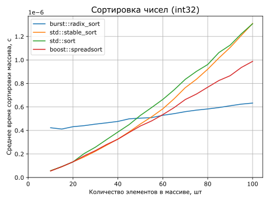

---

<!--
А вот что.
Масштаб изменился, поэтому внимательно.
Тут поразрядка выходит в лидеры уже на 18 элементах.
Неплохо.

Теперь попробуем посмотреть на большие масштабы.
-->

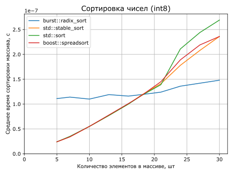

---

<!--
Здесь график немного другой, сейчас поясню.
По-первых, мы хотим посмотреть сразу на разные величины массивов, поэтому возьмём логарифмическую шкалу по оси X.
Во-вторых, из-за того, что мы взяли логарифмическую шкалу, график общего времени сортировки (для всех сортировок, кроме моей, естественно) улетел бы в космос. Поэтому пронормируем общее время на количество элементов. Получим время, затрачиваемое на сортировку одного элемента.
Побочный эффект такого графика — мы наглядно видим асимптотику сортировок.

Видно, что после того, как поразрядка опережает другие сортировки, она уходит в закат, и чем дальше, тем больше она выигрывает. Что логично, учитывая линейную асимптотику.

Результаты, согласитесь, офигенные. 2-3 наносекунды на элемент против десятков наносекунд у остальных в лучшем случае.
-->

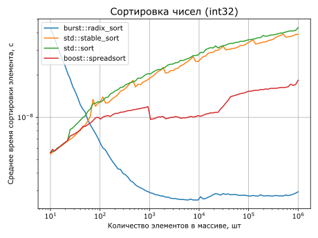

---

<!--
Можно посмотреть аналогичный график для int8.
Тут вообще меньше наносекунды на элемент.
-->

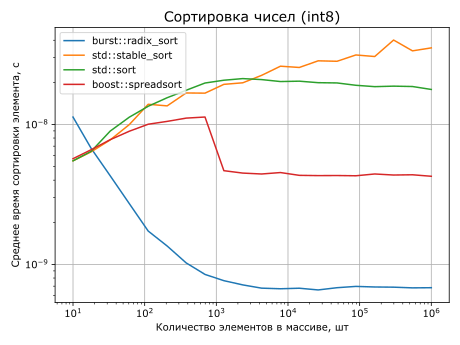

---

<!--
В общем, я эти результаты оформил, опубликовал статейку, и на этом успокоился. Это был 2015-й год.
-->


---

<!--
Шло время, наступил 2019-й год.

В то время я активно следил за развитием плюсов, просматривал все публикации
на isocpp.org и т.д. и т.п. И, конечно, не пропустил, когда российская
рабочая группа запустила сайт, где можно было оставить своё предложение в
стандарт.
-->


---

<!--
Тут же я отправил на stdcpp.ru предложение добавить в алгоритмы поразрядную сортировку. И стал ждать ответа.

А пока мы ждём ответа от рабочей группы, немного отвлечёмся и изучим сортировку под названием `std::stable_sort` в её реализации в LLVM (т.е. libc++).
-->


---

<!--
Алгоритм stable_sort устроен в целом достаточно просто. На верхнем уровне это сортировка слиянием. До тех пор, пока размер диапазона превышает заданный порог (по состоянию на сегодня это 128), диапазон разделяется на две половины, и для каждой из них рекурсивно вызывается stable_sort, а затем отсортированные поддиапазоны сливаются в один.
Когда размер массива становится не более 128, вызывается сортировка вставками.
Можно это представить в виде двоичного дерева с сортировкой вставкой в листьях и сортировкой слиянием во всех остальных вершинах.
-->


# Реализация `std::stable_sort` в libc++ (LLVM)


---

# Реализация `std::stable_sort` в libc++ (LLVM)

<!--
Итак, общую схему мы выяснили. Но есть и ещё один очень важный нюанс.
-->


- Вставка + слияние
-

---

# Реализация `std::stable_sort` в libc++ (LLVM)

<!--
Перед началом сортировки алгоритм пробует выделить дополнительный буфер размером с весь входной диапазон. Дело в том, что алгоритм слияния "на месте" гораздо хитрее и медленнее, чем алгоритм слияния с дополнительной памятью. И даже дополнительная аллокация компенсируется разницей в производительности.
Если удалось выделить память, то верхнеуровневая схема чуть-чуть меняется в деталях.
Теперь, если диапазон влезает в выделенный буфер, то все слияния будут происходить не "на месте", а через буфер, и размер поддиапазона, когда нужно переходить на сортировку вставками уменьшается (до 8, кажется). Ну и сама сортировка вставками тоже берётся другая, использующая буфер. В общем, становится чуть быстрее.
-->


- Вставка + слияние
- Выделяется буфер

---

<!--
Итак, мы выяснили, как устроен алгоритм `std::stable_sort`. А в это время пришёл ответ от рабочей группы.
Ребята были настроены скептично, и утверждали, что комитет, скорее всего, не одобрит новый алгоритм в STL.
Но, тем не менее, в процессе обсуждения была высказана очень интересная идея: можно добавить поразрядку в `std::stable_sort`.
Что получается: stable_sort использует дополнительную память, и поразрядка использует. stable_sort, как следует из названия, устойчив, и поразрядка устойчива.
Всё сходится. Можно использовать поразрядку в stable_sort в случае, если сортируются целые числа.
-->


---

<!--
Вот он, мой шанс внести вклад в развитие STL!
-->


---

<!--
Естественно, сразу я в LLVM не пошёл, а сначала пару лет попрокрастинировал.
-->


---

<!--
Не помню точно, сколько прошло времени, но в один прекрасный момент я решил: пора.
Склонировал LLVM, всунул свою супербыструю порязрядку, запустил бенчмарки,
-->


---

<!--
... и, собственно, на этом всё...
-->


# Всё...

---

<!--
только...
-->


# Всё только...

---

<!--
начинается...
-->


# Всё только начинается...

---

<!--
Да, на случайных данных поразрядка рвёт stable_sort как тузик грелку.
Никаких шансов.

Напоминаю, график вот такой.

Но, внезапно, на некоторых бенчмарках получил не только не ускорение, но
замедление, и достаточно сильное.
Стал разбираться и увидел, что std::stable_sort хитро оптимизирована под
разные сценарии, и "в лоб" поразрядка не всегда опережает stable_sort.
-->


---

<!--
Например, если массив уже отсортирован, `std::stable_sort` местами становится чуть быстрее поразрядки. А `std::sort` значительно быстрее.

Тут следует отдельно отметить `boost::spreadsort`. Он, казалось бы, показывает феноменальные результаты. Но фишка в том, что до 1000 элементов он сводится к `std::sort`, а после 1000 элементов в нём перед сортировкой происходит вызов `std::is_sorted`, и, если массив отсортирован, дальше ничего не происходит. Такой грязный трюк они могут провернуть из-за того, что принимают на вход отношение порядка. А ранее мы выяснили, что так делать нельзя из-за хрупкости интерфейса, значит, к такому трюку мы прибечь не можем. Ну и разработчики STL так тоже не делают. Так что график буста здесь полезен для сравнения алгоритмов реальных сортировок с проверкой на упорядоченность — `std::is_sorted`.
-->

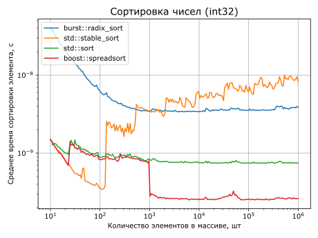

---

<!--
А если взять массив, состоящий из одинаковых элементов (а такой бенчмарк есть в LLVM, который мы собираемся оптимизировать), то поразрядка сразу становится хуже всех.

Дело в том, что, помимо всего прочего, `std::stable_sort` и `std::sort` обладают свойством естественности. Это значит, что если массив уже отсортирован, то количество
операций, произведённых алгоритмом, будет минимально.

Это радикально расходится с моей исходной концепцией — моя поразрядка во
всех ситуациях делает одно и то же, и работает за одно и то же время для
любого массива одной и той же длины, независимо от значений и расположения
элементов в нём.

Поэтому у меня и получилось, что на случайных данных я значительно быстрее, но
на "специальных" случаях я работаю за то же время, но stable_sort под них
оптимизирован, и работает быстрее.

Стал думать, а может ли порязрядка обладать таким же свойством
естественности — если массив отсортирован, то просто ничего не делать?

И оказалось, что может.
-->

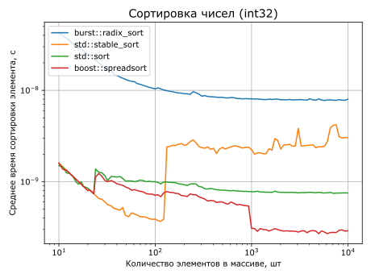

---

<!--
Что же из себя представляет естественность для челочисленных сортировок?
Как мы уже знаем, целочисленная сортировка состоит из двух основных фаз: подсчёт счётчиков и расстановки чисел по новым местам.
Можно ли сэкономить на подсчёте?
-->


# Естественность и оптимизации

❓ Сэкономить на подсчёте
❓ Сэкономить на расстановке

---

<!--
Я таких способов не вижу. Более того, всю информацию об итоговых позициях сортируемых чисел мы получаем именно на этапе подсчёта счётчиков. Поэтому эта фаза является строго обязательной.

Если кому-то вдруг известны способы, как можно сэкономить тут, пожалуйста, расскажите мне.

А что насчёт этапа расстановки по местам?
-->


# Естественность и оптимизации

❌ Сэкономить на подсчёте
❓ Сэкономить на расстановке

---

<!--
А вот тут можно сэкономить, и очень сильно.
-->


# Естественность и оптимизации

❌ Сэкономить на подсчёте
✅ Сэкономить на расстановке

---

<!--
Рассмотрим пример. Как обычно, для примера будем использовать десятичные разряды. Сортировать будем вот такие числа. Сверху не число, а нумерация разрядов.
-->


# Естественность и оптимизации

<style scoped>
table, blockquote {
    font-size: 60px;
    font-family: monospace;
}
th {
    color: grey
}
</style>

| 3 | 2 | 1 | 0 |
|:--|:--|:--|:--|
| 0 | 0 | 2 | 5 |
| 0 | 0 | 1 | 5 |
| 0 | 0 | 3 | 5 |
| 0 | 0 | 4 | 5 |

---

<!--
Посмотрим на младший разряд. Все цифры в нём одинаковые. Очевидно, это значит, что по этому разряду можно не сортировать. Но как понять, что числа в разряде одинаковые?
-->


# Естественность и оптимизации

<style scoped>
table, blockquote {
    font-size: 60px;
    font-family: monospace;
}
th {
    color: grey
}
</style>

| 3 | 2 | 1 | <span class="highlighted">0</span> |
|:--|:--|:--|:--|
| 0 | 0 | 2 | <span class="highlighted">5</span> |
| 0 | 0 | 1 | <span class="highlighted">5</span> |
| 0 | 0 | 3 | <span class="highlighted">5</span> |
| 0 | 0 | 4 | <span class="highlighted">5</span> |

---

<!--
Посмотрим на готовый массив счётчиков нулевого разряда для чисел нашего примера.
-->


# Естественность и оптимизации

<style scoped>
table, blockquote {
    font-size: 60px;
    font-family: monospace;
}
th {
    color: grey
}
</style>

<div class="columns">
<div>

| 3 | 2 | 1 | <span class="highlighted">0</span> |
|:--|:--|:--|:--|
| 0 | 0 | 2 | <span class="highlighted">5</span> |
| 0 | 0 | 1 | <span class="highlighted">5</span> |
| 0 | 0 | 3 | <span class="highlighted">5</span> |
| 0 | 0 | 4 | <span class="highlighted">5</span> |

</div>
<div>

Счётчики нулевого разряда

| 0 | 1 | 2 | 3 | 4 | 5 | 6 | 7 |
|:--|:--|:--|:--|:--|:--|:--|:--|
| 0 | 0 | 0 | 0 | 0 | 4 | 4 | 4 |

</div>
</div>

---

<!--
Мы видим, что в массиве счётчиков есть две полки — нули слева и четвёрки справа — и перепад между ними. Перепад происходит ровно на том значении, которое одиаковое для всех сортируемых чисел.
Но для нас даже не важно, на каком числе это происходит, а важно, что такой перепад в принципе есть и равен размеру сортируемого диапазона. Это однозначное свидетельство того, что числа одинаковые по данному разряду. А значит, их не нужно сортировать. Мы просто перекладываем числа в буфер в той же последовательности, в которой они находятся сейчас.
-->


# Естественность и оптимизации

<style scoped>
table, blockquote {
    font-size: 60px;
    font-family: monospace;
}
th {
    color: grey
}
</style>

<div class="columns">
<div>

| 3 | 2 | 1 | <span class="highlighted">0</span> |
|:--|:--|:--|:--|
| 0 | 0 | 2 | <span class="highlighted">5</span> |
| 0 | 0 | 1 | <span class="highlighted">5</span> |
| 0 | 0 | 3 | <span class="highlighted">5</span> |
| 0 | 0 | 4 | <span class="highlighted">5</span> |

</div>
<div>

Счётчики нулевого разряда

| 0 | 1 | 2 | 3 | 4 | 5 | 6 | 7 |
|:--|:--|:--|:--|:--|:--|:--|:--|
| 0 | 0 | 0 | 0 | <span class="highlighted">0</span> | <span class="highlighted">4</span> | 4 | 4 |

</div>
</div>

---

<!--
Итак, по нулевому разряду сортировать не нужно.
-->


# Естественность и оптимизации

<style scoped>
table, blockquote {
    font-size: 60px;
    font-family: monospace;
}
th {
    color: grey
}
</style>

| 3 | 2 | 1 | <span class="highlighted">0</span> |
|:--|:--|:--|:--|
| 0 | 0 | 2 | <span class="highlighted">5</span> |
| 0 | 0 | 1 | <span class="highlighted">5</span> |
| 0 | 0 | 3 | <span class="highlighted">5</span> |
| 0 | 0 | 4 | <span class="highlighted">5</span> |

---

<!--
По первому разяду сортируем как обычно.
-->


# Естественность и оптимизации

<style scoped>
table, blockquote {
    font-size: 60px;
    font-family: monospace;
}
th {
    color: grey
}
</style>

| 3 | 2 | <span class="highlighted">1</span> | 0 |
|:--|:--|:--|:--|
| 0 | 0 | <span class="highlighted">2</span> | 5 |
| 0 | 0 | <span class="highlighted">1</span> | 5 |
| 0 | 0 | <span class="highlighted">3</span> | 5 |
| 0 | 0 | <span class="highlighted">4</span> | 5 |

---

# Естественность и оптимизации


<style scoped>
table, blockquote {
    font-size: 60px;
    font-family: monospace;
}
th {
    color: grey
}
</style>

| 3 | 2 | <span class="highlighted">1</span> | 0 |
|:--|:--|:--|:--|
| 0 | 0 | <span class="bright">1</span> | 5 |
| 0 | 0 | <span class="bright">2</span> | 5 |
| 0 | 0 | <span class="bright">3</span> | 5 |
| 0 | 0 | <span class="bright">4</span> | 5 |

---

<!--
А теперь посмотрим на два старших разряда. В обоих та же история, что с младшим разрядом. Это значит, что с каждым из них можно было бы поступить, как с ним: перенести значения в буфер, а затем обратно.
Но это фактически эквивалентно тому, чтобы не делать вообще ничего.
То есть если два подряд разряда имеют одинаковые значения, мы будем просто пропускать эти два разряда.

И самое главное, что это не такой уж искуственный пример.
Очень часто нужно сортировать тип, например, std::int32_t, содержащий какие-нибудь индексы, и эти числа малы относительно всего диапазона значений данного типа. Получается, что достаточно большое количество старших разрядов — просто нули, которые можно игнорировать.
-->


# Естественность и оптимизации

<style scoped>
table, blockquote {
    font-size: 60px;
    font-family: monospace;
}
th {
    color: grey
}
</style>

| <span class="highlighted">3</span> | <span class="highlighted">2</span> | 1 | 0 |
|:--|:--|:--|:--|
| <span class="highlighted">0</span> | <span class="highlighted">0</span> | 1 | 5 |
| <span class="highlighted">0</span> | <span class="highlighted">0</span> | 2 | 5 |
| <span class="highlighted">0</span> | <span class="highlighted">0</span> | 3 | 5 |
| <span class="highlighted">0</span> | <span class="highlighted">0</span> | 4 | 5 |

---

<!--
Итак, мы прокачали естественность. Научились делать гораздо меньше перестановок на основе информации о счётчиках.

Но это ещё не всё.
Проведём ещё одно важное наблюдение.
При подсчёте счётчиков мы совершаем один проход по исходным элементам, отображая их в целые числа согласно заданной функции. И у нас действительно нет возможности сравнить исходные элементы.
Но.
Мы можем сравнивать числа, в которые они отображаются, потому что сортировка по определению сортирует по возрастанию этих чисел. Значит, если образы уже упорядочены, то упорядочены и исходные элементы.
Ну так давайте при подсчёте счётчиков заодно проверим порядок на целых числах.
-->


# Естественность и оптимизации

- Одинаковые значения одного разряда — переносим в буфер
- Одинаковые значения в двух подряд разрядах — не делаем ничего
- 

---

<!--
Получаем ещё одну мощную оптимизацию. Если элементы уже упорядочены, то, независимо от значений счётчиков, дальше просто ничего не делаем.

Тут сразу возникает вопрос: ведь эти оптимизации требуют дополнительных расчётов, и, хотя они ускоряют алгоритм в особых случаях, в произвольных ситуациях они будут замедлять алгоритм.
-->


# Естественность и оптимизации

- Одинаковые значения одного разряда — переносим в буфер
- Одинаковые значения в двух подряд разрядах — не делаем ничего
- Не сортируем, если уже упорядочены

---

<!--
Это правда, но выигрыш в произвольном случае НАСТОЛЬКО велик, что микроскопическое замедление с лихвой окупается улучшением в граничных случаях. Это эамедление с трудом можно разглядеть вот на таком графике. Видно, что график сортировки с оптимизациями чу-уть-чуть выше графика без оптимизаций.
-->

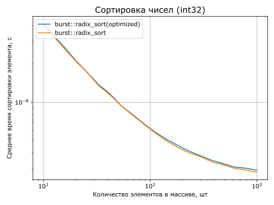

---

<!--
Итак, я реализовал все указанные оптимизации, внедрил их в `std::stable_sort`.
Вот так было:
-->


---

<!--
А вот так стало.
И на больших массивах снова всё очень неплохо. График стал сильно ниже.
Но на маленьких массивах всё равно проигрыш очень сильный.
И, казалось бы, установим нижний предел, начиная с которого поразрядка будет выигрывать, и всё.
-->


---

<!--
Но оказывается, что не всё. Есть замеры, на которых поразрядка всё ещё проигрывает `std::stable_sort`. А мы, напоминаю, не имеем права быть хуже.
Придётся разбираться.
Что же это за ситуация?
-->


---

<!--
Дело в том, что для поразрядной сортировки даже один элемент, отличающийся от всех остальных по всем разрядам, ломает все оптимизации, так что придётся отсортировать весь массив полностью, со всеми подсчётами и перестановками. А в случае больших чисел (int64, int128) это дорого.
И на предудыщем графике именно эта ситуация.
-->


# Естественность и оптимизации

<style scoped>
table, blockquote {
    font-size: 60px;
    font-family: monospace;
}
th {
    color: grey
}
</style>

| 3 | 2 | 1 | 0 |
|:--|:--|:--|:--|
| 0 | 0 | 0 | 0 |
| 0 | 0 | 0 | 0 |
| <span class="highlighted">1</span> | <span class="highlighted">1</span> | <span class="highlighted">1</span> | <span class="highlighted">1</span> |
| 0 | 0 | 0 | 0 |

---

<!--
А что же `stable_sort`?
Из-за того, что `stable_sort` является сортировкой слиянием и разбивает исходный диапазон на поддиапазоны, для каждого такого поддиапазона применима естественность исходного алгоритма. То есть каждый неубывающий кусочек будет обработан очень быстро. И только красный поддиапазон, в который попадает выброс — красный элемент — будет сортироваться полноценно. А все остальные уже отсортированы.

До сих пор мы пытались полностью подменить `stable_sort` на поразрядку в случае целых чисел, а нужно более хитро встраиваться в гибридную схему.

То есть нужно найти порог, который будет говорить, при каком размере массива нужно побить его на две части и обработать каждую из них отдельно, а при каком уже можно применить поразрядную сортировку.
-->


---

<!--
Классический `stable_sort`, как мы помним, можно представить в виде дерева, в листьях которого сортировка вставками, а на остальных вершинах — сортировка слиянием.
-->


---

<!--
А мы изменим его так, чтобы в листьях была поразрядка, при этом само дерево будет другим.
Итак, встраиваемся в гибридную схему, подбираем пороги.
Пороги, по очевидным причинам, будут зависеть от размера сортируемого числа.
Для всех чисел, кроме uint8, хорошо подходит нижний порог в 1024.
Для uint8 же можно взять более низкий порог — 256, потому что числа из одного разряда, очевидно, будут сортироваться быстрее, т.к. нужно считать счётчики только одного разряда.
С максимальным порогом работает обратная зависимость. Для всех чисел, разрядность которых не менее 8 (то есть uint64 и uint128 (да, такие тоже есть)), подойдёт верхний порог в 2^16=65536. А для больших чисел можно взять меньший порог — у меня это 2^15. Для больших чисел порог меньше, потому что много разрядов сортируется дольше, и ошибка промаха по оптимизации высока.
-->


---

<!--
Смотрим на графики.

Показываю график для int128. Напоминаю, что до внедрения в гибридную схему график был выше по всей длине. То есть раньше было хуже всегда, а теперь почти всегда лучше, но есть вот этот диапазон от 1024 до 65536, на котором мы всё ещё хуже.
Зачем же я показываю этот график? Зачем мне позориться.
Дело в том, что этот график показывает цену оптимизации. Вернее, цену всего, что было сделано.
То есть вот этот отрезочек для int128 — это единственное место, где поразрядка проигрывает.
Во всех остальных ситуациях мы точно не медленнее, чем `std::stable_sort`, а в некоторых случаях настолько быстрее, что опережаем даже `std::sort`.

А теперь посмотрим, ради чего всё это было.
-->

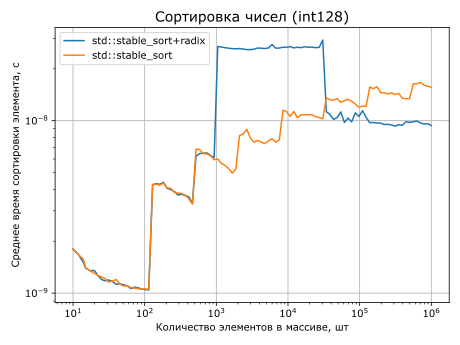

---

<!--
График для int8.
На что смотреть?
Мы всегда лучше, чем `std::stable_sort`. Он тут просто для красоты.
Теперь мы смотрим только на зелёный график (`std::sort`) и синий график (оптимизированный `std::stable_sort`).
Потому что наша цель — быть быстрее, чем `std::sort`.
-->

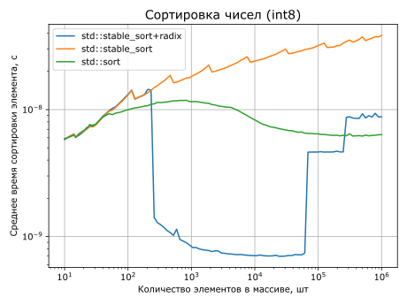

---

<!--
График для int16.
Надо отметить вот эти ступеньки на графике. Они являются следствием того, что мы перешли на гибридную схему, и встроились в дерево слияний. По сути, график асимптотически стремится к графику `std::stable_sort`, и сольётся с ним тогда, когда сортировка будет пренебрежимо мала по сравнению с временем, затрачиваемым на слияния.
-->


---

<!--
То же самое мы видим на графике для int32.
Обратите внимание, что на массивах порядка 10^6 речь идёт об экономии десятков миллисекунд. Это может быть ощутимо даже для каких-нибудь веб-приложений, не говоря уже о критичных к скорости вычислениях.
-->

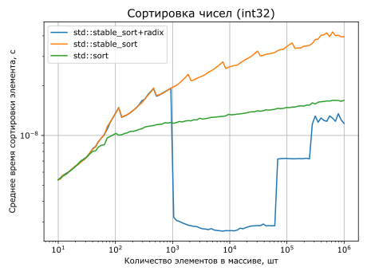

---

<!--
График для int64 укладывается в общую канву.
Все эти графики — это то, что вот прямо сейчас залито в LLVM (версия 20).
В этом году планирую дойти до того, чтобы поточнее подобрать пороги для разных типов, и границы вот этого "провала" ещё расширятся.
Понятно, что можно убрать верхний порог, и тогда ступеньки уйдут, и `std::stable_sort` будет оставаться на уровне поразрядки. Но нужно аккуратно учесть все специальные случаи.
Поэтому сейчас параметры такие, и результат уже очень неплохой.
-->

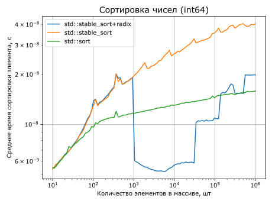

---

<!--
Довольный, иду оформлять ПР.
Зашёл в Phabricator, взял в руки arc (это такая доморощенная приблуда для контроля версий)...
-->


---

<!--
... и прифигел.
Поднимите руки, кто вносил правки в LLVM во времена фабрикатора и арка. Вы — герои!
Phabricator и arc — ужасная дрянь. 

В общем, в итоге просто забил.
-->


---

<!--
Прошло ещё немного времени. Наступил 2024.
Гештальт не закрывается.
Зейгарник мучает.
Решил: я ж программист! Разберусь и добью!
-->


---

<!--
Собрал волю в кулак, пошёл на сайт LLVM и внезапно обнаружил, что в LLVM перешли на гитхаб и нормальную схему внесения правок.

Запилил ПР.
Прошёл согласования.
Профит.
-->


# 2024

* Запилил ПР
* Прошёл согласования
* Профит

---

<!--
Какие выводы можно сделать из этой истории?
Во-первых, не бойтесь проверять "известные факты". Часто это не факты, а
распространённое заблуждение.
Во-вторых, не бойтесь рассказывать даже о самых, казалось бы,
незначительных достижениях. Даже если не получится применить идею так, как
думалось изначально, то хорошая вещь всё равно найдёт применение.
В-третьих, не затягивайте. Не откладывай на десять лет то, что можно было
сделать вчера.
-->


# Выводы

* Проверяйте
* Делитесь
* Не затягивайте

---

<!--
Ну и главный результат:
Если используете libc++ и сортируете целые — `std::sort` не всегда лучший выбор. Раньше никто в здравом уме не использовал `std::stable_sort` для целых чисел. Теперь же есть осязаемая альтернатива, причём разница может быть на порядок, то есть в 10 раз.
Я говорил, что жизнь станет лучше, но сложнее. И это оно и есть — теперь нужно думать. Если заранее известно, что сортируемые данные какие-то особо специальные (например, с большой вероятностью уже упорядочены), то тогда лучше брать `std::sort`. Во всех остальных случаях лучше брать `std::stable_sort`.
-->


# Результаты

* `std::sort` теперь не всегда лучший выбор
* Сортировать целые и плавучку теперь можно гораздо быстрее
* Но нужно понимать границы применения

---


<div class="columns">
<div>


# Эта презентация онлайн

</div>
<div>


</div>
</div>

---

<!--
Из стандарта IEEE 754 мы знаем, что:
1.  Битовое представление положительных чисел непосредственно отражает их порядок:
    При сравнении чисел по модулю число с большим показателем степени окажется
    больше, а если показатели степени равны, большим окажется то, у которого большая
    мантисса.
2.  Битовое представление отрицательных чисел отражает их обратный порядок (из тех
    же соображений).
3.  Старший бит равен нулю для положительных чисел и единице для отрицательных чисел.
    Поэтому в исходном битовом представлении любое отрицательное число будет больше
    любого положительного.

Исходя их этих вводных, чтобы получить упорядоченное битовое представление чисел с
плавающей запятой, нужно:
1.  Инвертировать битовое представление (включая знаковый бит) отрицательных чисел,
    чтобы перейти от обратного порядка к прямому;
2.  Инвертировать знаковый бит для положительных чисел.

Таким образом, мы развернули порядок на отрицательных числах и все отрицательные
числа сделали меньше всех положительных (за счёт инвертирования знакового бита).
-->


# Плавучка

### IEEE 754, одинарная точность (float32)

```
+------+-------------------------------+-------------------------------------------------------------------------------------------+
| Знак |            Порядок            |                                         Мантисса                                          |
+------+---+---+---+---+---+---+---+---+---+---+---+---+---+---+---+---+---+---+---+---+---+---+---+---+---+---+---+---+---+---+---+
|    0 | 0 | 0 | 1 | 1 | 1 | 1 | 1 | 0 | 0 | 1 | 0 | 0 | 0 | 0 | 0 | 0 | 0 | 0 | 0 | 0 | 0 | 0 | 0 | 0 | 0 | 0 | 0 | 0 | 0 | 0 | 0 |
+------+---+---+---+---+---+---+---+---+---+---+---+---+---+---+---+---+---+---+---+---+---+---+---+---+---+---+---+---+---+---+---+
| 31                            24 | 23                         16 | 15                          8 | 7                           0 |
```

---

<!--
Поддерживаются все типы с плавающей запятой, включая типы фиксированной битности из C++23.
Единственный тип, который не поддерживается — это `long double`.

`long double` сильно различается в зависимости от платформы и компилятора,
и определить его битность, чтобы привести к упорядоченному целому, практически
невозможно.

`numeric_limits<long double>::is_iec559` может быть истинно не только для
128-битных `long double`, но и для 80-битных. При этом фактический размер
80-битного `long double` (то, что возвращает `sizeof`) может быть и 10, и 12, и 16.
"Пустые биты", т.е. сверх используемых 80-ти, могут быть заполнены произвольными
данными.
Определить реальную битность можно только эвристически, например, найдя знаковый бит
по формуле:

\code{.cpp}
std::countr_zero
(
    std::bitcast<uint128_t>(-std::numeric_limits<F>::infinity()) ^
    std::bitcast<uint128_t>( std::numeric_limits<F>::infinity())
);
\endcode

Но даже если правильно определить битность, то на текущий момент (29.03.2025)
`std::bit_cast<uint128_t>(long double)` не является `constexpr`.
-->


# Плавучка

<div class="columns">
<div>

✅ `float`
✅ `double`
✅ `std::float16_t`
✅ `std::float32_t`

</div>
<div>

✅ `std::float64_t`
✅ `std::float128_t`
✅ `std::bfloat16_t`
❌ `long double`

</div>
</div>
